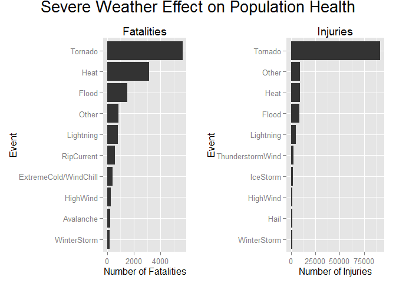
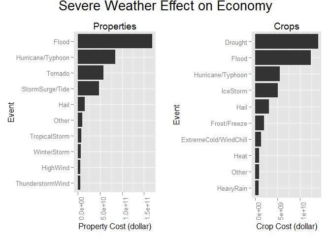
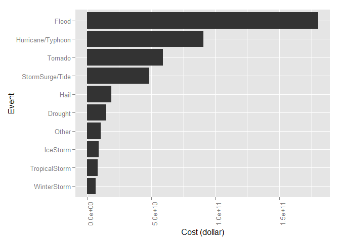

# Reproducible Research: Peer Assessment 2
Jimmy Qiu  
October 26, 2014  
## Synopsis

In this peer assessment we examine the effects of severe weather on population health and economy. We process the storm data from U.S. National Oceanic and Atmospheric Administration and use National Weather Service Storm Data Documentation as a code book and guide to clean the data. The storm data is classified accordingly to the 48 events listed in the Storm Data Documentation. We then aggregate on the storm data by these events to get population health metrics via fatalities and injuries, and economic damage metrics via property and crop damage.

## Data Processing

We begin by loading in the sever weather events data.


```r
stormData <- read.csv("repdata-data-StormData.csv")
```

First we look at the different event types (EVTYPE) to get a sense of how we should process the data.


```r
head(unique(stormData$EVTYPE), 10)
```

```
##  [1] TORNADO                   TSTM WIND                
##  [3] HAIL                      FREEZING RAIN            
##  [5] SNOW                      ICE STORM/FLASH FLOOD    
##  [7] SNOW/ICE                  WINTER STORM             
##  [9] HURRICANE OPAL/HIGH WINDS THUNDERSTORM WINDS       
## 985 Levels:    HIGH SURF ADVISORY  COASTAL FLOOD ... WND
```

```r
length(unique(stormData$EVTYPE))
```

```
## [1] 985
```

We can see that the EVTYPE factors are a bit inconsistent. There are some non-unique identifiers and some event types have upper case while others have lower case.

Let's remap these factors so that it's more consistent with the National Weather Service Storm Data Documentation (see PA2 page for link). Examining the Storm Data Event Table (Storm Data Documentation pg. 6), we should be able to reduce the 900+ factors down to 48.

Let's create a pattern vector that maps some of the keywords to the 48 events. We'll use regular expressions to match each event's keywords in the Storm Data Documentation.


```r
patterns = c("(?=.*astronomical)(?=.*low)(?=.*tide)", "avalanche", "blizzard", 
             "(?=.*coastal)(?=.*flood)", "(?=.*cold)|(?=.*wind)(?=.*chill)", 
             "(?=.*debris)(?=.*flow)", "(?=.*dense)(?=.*fog)", 
             "(?=.*dense)(?=.*smoke)", "(?=.*drought)", "(?=.*dust)(?=.*devil)", 
             "(?=.*dust)(?=.*storm)", "(?=.*excessive)(?=.*heat)", 
             "(?=.*extreme)(?=.*cold)|(?=.*wind)(?=.*chill)", 
             "(?=.*flash)(?=.*flood)", "flood", "frost|freeze", 
             "(?=.*funnel)(?=.*cloud)", "(?=.*freezing)(?=.*fog)", "hail", 
             "heat", "(?=.*heavy)(?=.*rain)", "(?=.*heavy)(?=.*snow)", 
             "(?=.*high)(?=.*surf)", "(?=.*high)(?=.*wind)", 
             "hurricane|typhoon", "(?=.*ice)(?=.*storm)", 
             "(?=.*lake-effect|lakeeffect)(?=.*snow)", 
             "(?=.*lakeshore)(?=.*flood)", 
             "lightning", "(?=.*marine)(?=.*hail)", 
             "(?=.*marine)(?=.*high)(?=.*wind)", 
             "(?=.*marine)(?=.*strong)(?=.*wind)", 
             "(?=.*marine)(?=.*thunderstorm)(?=.*wind)", 
             "(?=.*rip)(?=.*current)", "seiche", "sleet", 
             "(?=.*tide)|(?=.*storm)(?=.*surge)", "(?=.*strong)(?=.*wind)", 
             "(?=.*thunderstorm)(?=.*wind)", "tornado", 
             "(?=.*tropical)(?=.*depression)", "(?=.*tropical)(?=.*storm)", 
             "tsunami", "(?=.*volcanic)(?=.*ash)", "watersprout", "wildfire", 
             "(?=.*winter)(?=.*storm)", "(?=.*winter)(?=.*weather)")
events = c("AstronomicalLowTide", "Avalanche", "Blizzard", "CoastalFlood", 
           "Cold/WindChill", "DebrisFlow", "DenseFog", "DenseSmoke", "Drought",
           "DustDevil", "DustStorm", "ExcessiveHeat", "ExtremeCold/WindChill",
           "FlashFlood", "Flood", "Frost/Freeze", "FunnelCloud", "FreezingFog",
           "Hail", "Heat", "HeavyRain", "HeavySnow", "HighSurf", "HighWind",
           "Hurricane/Typhoon", "IceStorm", "LakeEffectSnow", "LakeshoreFlood",
           "Lightning", "MarineHail", "MarineHighWind", "MarineStrongWind",
           "MarineThunderstormWind", "RipCurrent", "Seiche", "Sleet",
           "StormSurge/Tide", "StrongWind", "ThunderstormWind", "Tornado",
           "TropicalDepression", "TropicalStorm", "Tsunami", "VolcanicAsh",
           "Watersprout", "Wildfire", "WinterStorm", "WinterWeather")
```

### Effect on Population Health 

Since we only need to look at effect on population health and economy, we can subset the data to work with a smaller set. Let's examine the effect on population by looking at the weather with respect to fatalities and injuries.


```r
healthData <- subset(stormData, stormData$FATALITIES > 0 | stormData$INJURIES > 0)
```

Now let's add a column variable to hold our new event classifications. We'll set the default value to "Other" - which will indicate events that doesn't fit our regexp searches. We then use the `patterns` and `events` defined above to label `EVTYPE` factors using `grep`.


```r
healthData["EVENT"] <- "Other"

for (i in 1:length(patterns)){
  match = grep(patterns[i], healthData$EVTYPE, ignore.case=T, perl=T)

  if (length(match) > 0){    
    healthData[match, c("EVENT")] = events[i]
  } 
}  
```

Using the `plyr` package, we can summarize the fatalities and injuries by event type. We'll extract the top 10 events that correspond to number of fatalities and injuries.


```r
library(plyr)
healthSummary <- ddply(healthData, .(EVENT), summarize, totFat=sum(FATALITIES), totInjuries=sum(INJURIES))
topFatalities <- healthSummary[order(-healthSummary[, 2]),][1:10, c(1,2)]
topFatalities$EVENT <- factor(topFatalities$EVENT, levels = topFatalities[order(topFatalities$totFat), "EVENT"])
topInjuries <- healthSummary[order(-healthSummary[, 3]),][1:10, c(1,3)]
topInjuries$EVENT <- factor(topInjuries$EVENT, levels = topInjuries[order(topInjuries$totInjuries), "EVENT"])
```

### Effect on Economy

In addition to the event mapping to reduce the `EVTYPE` factors to the 48 events of the Storm Data Documentation, we also need to transform the property and crop damage to monetary values using `PROPDMG`, `PROPDMGEXP`, `CROPDMG`, and `CROPDMGEXP`.


```r
levels(stormData$PROPDMGEXP)
```

```
##  [1] ""  "-" "?" "+" "0" "1" "2" "3" "4" "5" "6" "7" "8" "B" "h" "H" "K"
## [18] "m" "M"
```

```r
levels(stormData$CROPDMGEXP)
```

```
## [1] ""  "?" "0" "2" "B" "k" "K" "m" "M"
```

The Storm Data Documentation (pg. 12) gives some indication for what the factors mean. The numeric value indicates the number of zeros following 1. For example, a 2 for `PROPDMGEXP` a multiplicative factor of 100. B, H, M, K, stands for billion, hundred, million, and thousand respectively. I have chosen a multiplicative factor of 1 for ?, +, and - characters. Though I couldn't find documentation for what they stand for, I think it makes sense that ? indicates 'around', + indicates 'above', and - indicates 'up to'. 

We'll create pattern vectors to match the factors and set the multiplicative factor accordingly.


```r
multPattern = c("0", "1", "2", "3", "4", "5", "6", "7", "8", "9", "b", "m", "k",
                "h")
multFactor = c(1, 10, 100, 1000, 10000, 100000, 1000000, 10000000, 100000000,
               1000000000, 1000000000, 1000000, 1000, 100)
```

Let's extract the subset of data that had economic impact.


```r
economyData <- subset(stormData, stormData$PROPDMG > 0 | stormData$CROPDMG > 0)
```

Let's create new variables to store the multiplicative factor and match the patterns to set them accordingly. We will then calculate the costs by using the multiplicative factors.


```r
economyData["PROPMULT"] <- 1
economyData["CROPMULT"] <- 1

for (i in 1:length(multPattern)){
  matchProp = grep(multPattern[i], economyData$PROPDMGEXP, ignore.case=T, perl=T)
  matchCrop = grep(multPattern[i], economyData$CROPDMGEXP, ignore.case=T, perl=T)
  
  if (length(matchProp) > 0){    
    economyData[matchProp, c("PROPMULT")] = multFactor[i]
  } 
  
  if (length(matchCrop) > 0){    
    economyData[matchCrop, c("CROPMULT")] = multFactor[i]
  } 
}  

economyData["PROPCOST"] = economyData["PROPMULT"] * economyData["PROPDMG"]
economyData["CROPCOST"] = economyData["CROPMULT"] * economyData["CROPDMG"]
```

Now we map the `EVTYPE` factors to the 48 events as we did before when looking at population health.


```r
economyData["EVENT"] <- "Other"

for (i in 1:length(patterns)){
  match = grep(patterns[i], economyData$EVTYPE, ignore.case=T, perl=T)

  if (length(match) > 0){    
    economyData[match, c("EVENT")] = events[i]
  } 
}  
```

Again, using the `plyr` package we will total the costs by events using `ddply`.


```r
economySummary <- ddply(economyData, .(EVENT), summarize, totProp=sum(PROPCOST), totCrop=sum(CROPCOST))
topProp <- economySummary[order(-economySummary[, 2]),][1:10, c(1,2)]
topProp$EVENT <- factor(topProp$EVENT, levels = topProp[order(topProp$totProp), "EVENT"])
topCrop <- economySummary[order(-economySummary[, 3]),][1:10, c(1,3)]
topCrop$EVENT <- factor(topCrop$EVENT, levels = topCrop[order(topCrop$totCrop), "EVENT"])
```

We can sum the property and crop costs to get the total economic burden for the events.


```r
economySummary["TOTAL"] <- economySummary$totProp + economySummary$totCrop
topTotal <- economySummary[order(-economySummary[, 4]),][1:10, c(1,4)]
topTotal$EVENT <- factor(topTotal$EVENT, levels = topTotal[order(topTotal$TOTAL), "EVENT"])
```

## Results

### Effect on Population Health

The top 10 events by total fatalities and injuries is listed and plotted below.


```r
topFatalities
```

```
##                    EVENT totFat
## 28               Tornado   5661
## 13                  Heat   3138
## 9                  Flood   1524
## 22                 Other    867
## 20             Lightning    817
## 23            RipCurrent    577
## 8  ExtremeCold/WindChill    399
## 17              HighWind    295
## 1              Avalanche    224
## 32           WinterStorm    217
```

```r
topInjuries
```

```
##               EVENT totInjuries
## 28          Tornado       91407
## 22            Other        9492
## 13             Heat        9224
## 9             Flood        8602
## 20        Lightning        5232
## 27 ThunderstormWind        2439
## 19         IceStorm        1992
## 17         HighWind        1507
## 12             Hail        1466
## 32      WinterStorm        1353
```

```r
library(ggplot2)
library(grid)
library(gridExtra)

topInjuries1 <- topInjuries
topInjuries1$EVENT <- factor(topInjuries$EVENT, levels = topInjuries[order(topInjuries$totInjuries), "EVENT"])

p1 <- ggplot(topFatalities, aes(EVENT, totFat)) + 
      geom_bar(stat="identity") +
      coord_flip() +
      xlab("Event") +
      ylab("Number of Fatalities") +
      ggtitle("Fatalities")
p2 <- ggplot(topInjuries, aes(EVENT, totInjuries)) + 
      geom_bar(stat="identity") +
      coord_flip() +
      xlab("Event") +
      ylab("Number of Injuries") +
      ggtitle("Injuries")

grid.arrange(p1, p2, ncol = 2, main = textGrob("Severe Weather Effect on Population Health", gp = gpar(fontsize=20)))
```

 

From the results above we can see that tornadoes, floods, heat, and lightning are high with respect to both fatalities and injuries.

### Effect on Economy

The top 10 events by property and crop damage is listed and plotted below.


```r
topProp
```

```
##                EVENT   totProp
## 10             Flood 1.682e+11
## 20 Hurricane/Typhoon 8.536e+10
## 34           Tornado 5.860e+10
## 31   StormSurge/Tide 4.797e+10
## 14              Hail 1.602e+10
## 27             Other 9.833e+09
## 36     TropicalStorm 7.714e+09
## 40       WinterStorm 6.750e+09
## 19          HighWind 6.005e+09
## 33  ThunderstormWind 5.432e+09
```

```r
topCrop
```

```
##                    EVENT   totCrop
## 6                Drought 1.397e+10
## 10                 Flood 1.238e+10
## 20     Hurricane/Typhoon 5.516e+09
## 21              IceStorm 5.022e+09
## 14                  Hail 3.112e+09
## 12          Frost/Freeze 1.997e+09
## 9  ExtremeCold/WindChill 1.331e+09
## 15                  Heat 9.045e+08
## 27                 Other 8.679e+08
## 16             HeavyRain 7.943e+08
```

```r
p1 <- ggplot(topProp, aes(EVENT, totProp)) + 
      geom_bar(stat="identity") +
      coord_flip() +
      theme(axis.text.x = element_text(angle = 90, hjust = 1)) +
      xlab("Event") +
      ylab("Property Cost (dollar)") +
      ggtitle("Properties")
p2 <- ggplot(topCrop, aes(EVENT, totCrop)) + 
      geom_bar(stat="identity") +
      coord_flip() +
      theme(axis.text.x = element_text(angle = 90, hjust = 1)) +
      xlab("Event") +
      ylab("Crop Cost (dollar)") +
      ggtitle("Crops")

grid.arrange(p1, p2, ncol = 2, main = textGrob("Severe Weather Effect on Economy", gp = gpar(fontsize=20)))
```

 

We can see that regarding crop damage, droughts, floods, hurricanes, and ice storms are the most damaging economically. Whereas for properties, floods, hurricanes, tornadoes, and tides are most damaging. This does make sense intuitively.

The top 10 events by total economic damage is listed and plotted below.


```r
topTotal
```

```
##                EVENT     TOTAL
## 10             Flood 1.806e+11
## 20 Hurricane/Typhoon 9.087e+10
## 34           Tornado 5.902e+10
## 31   StormSurge/Tide 4.798e+10
## 14              Hail 1.913e+10
## 6            Drought 1.502e+10
## 27             Other 1.070e+10
## 21          IceStorm 8.968e+09
## 36     TropicalStorm 8.409e+09
## 40       WinterStorm 6.782e+09
```

```r
p1 <- ggplot(topTotal, aes(EVENT, TOTAL)) + 
      geom_bar(stat="identity") +
      coord_flip() +
      theme(axis.text.x = element_text(angle = 90, hjust = 1)) +
      xlab("Event") +
      ylab("Cost (dollar)")

plot(p1, main = textGrob("Severe Weather Effect on Economy", gp = gpar(fontsize=20)))
```

 

Here we can see the total cost is similar to that of property cost. In fact, the top four sever weather events with respect to total cost are the same as for property cost. Economic costs from severe weather effects are dominantly from property damages.
